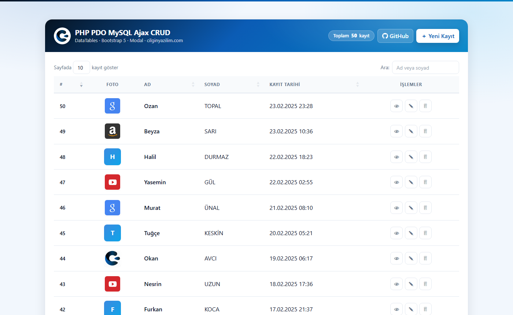
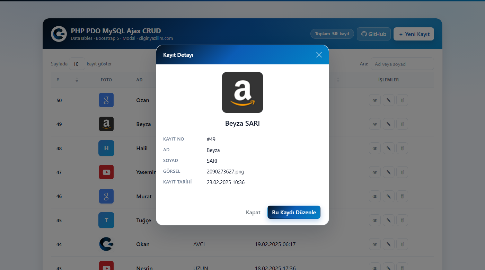
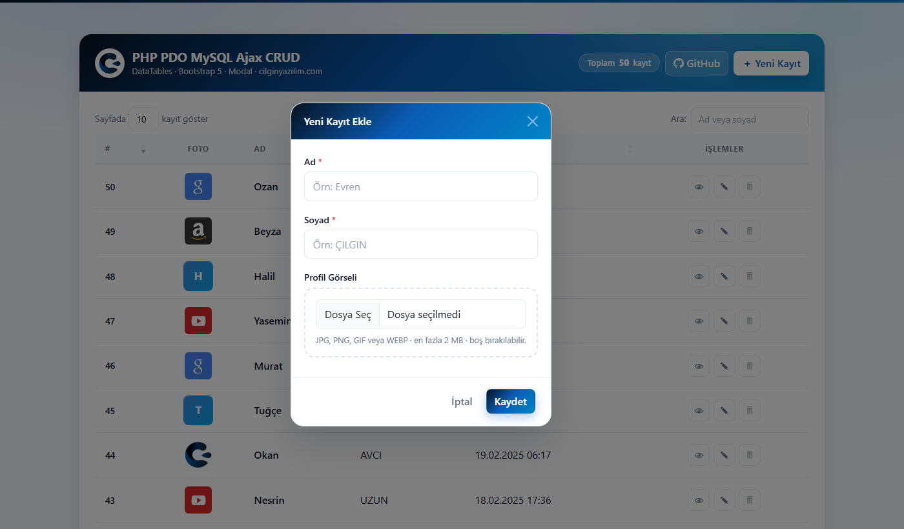
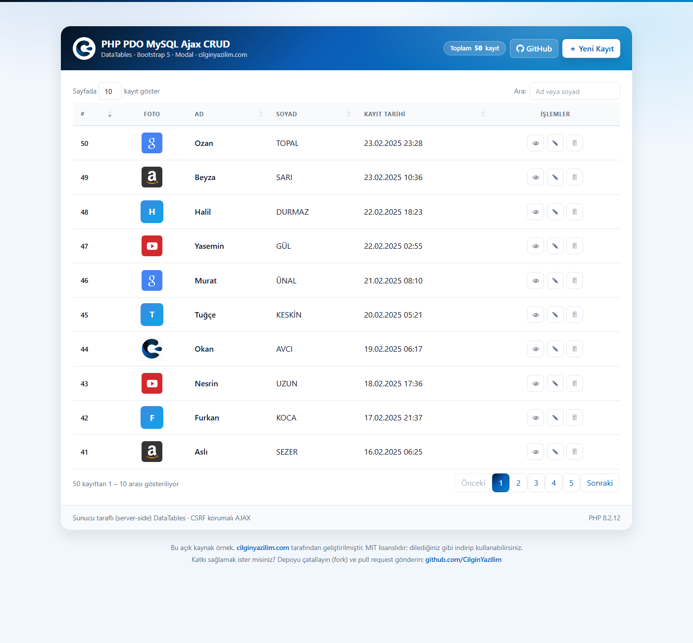
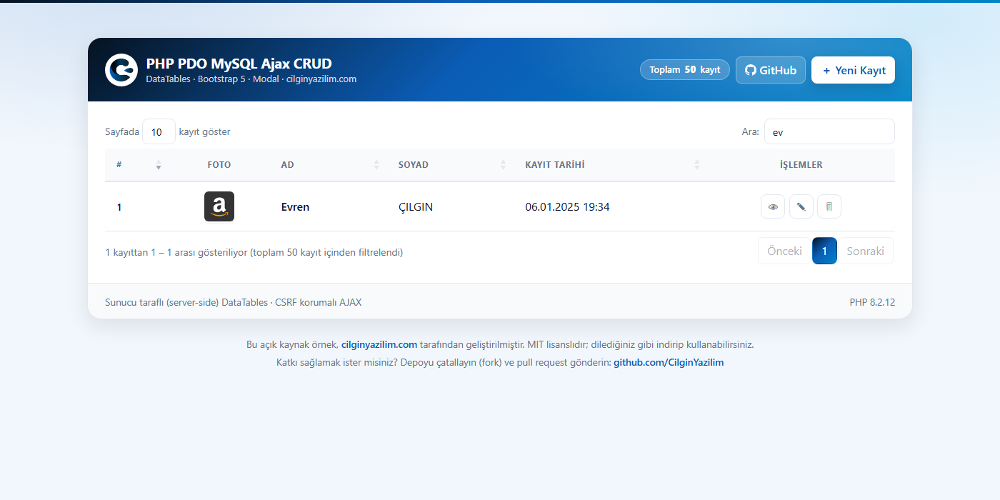

<div align="center">

# PHP PDO MySQL Ajax CRUD

### DataTables · Bootstrap 5 · Modal · Çılgın Yazılım Tasarım Kalıbı

**Güvenli, açıklamalı ve indirir indirmez çalışan bir CRUD örneği.**

[](https://php.net)
[](https://mysql.com)
[](https://getbootstrap.com)
[](https://datatables.net)
[](LICENSE)

**🇹🇷 Türkçe** &nbsp;·&nbsp; [🇬🇧 English](README.en.md)

[**▶ Canlı Demo**](https://cilginyazilim.com/kutuphane/php-pdo-ajax-crud/calistir) &nbsp;·&nbsp; [Kaynak Kütüphanesi](https://cilginyazilim.com/kutuphane/php-pdo-ajax-crud) &nbsp;·&nbsp; [cilginyazilim.com](https://cilginyazilim.com)

</div>

---

<div align="center">

## Canlı Demo

**Kurulum yok, kayıt yok, indirme yok — tarayıcınızdan 3 saniyede deneyin.**

<a href="https://cilginyazilim.com/kutuphane/php-pdo-ajax-crud/calistir"></a>
&nbsp;
<a href="https://cilginyazilim.com/kutuphane/php-pdo-ajax-crud"></a>
&nbsp;
<a href="https://github.com/CilginYazilim/PHP-PDO-MySQL-Ajax-CRUD-DataTables-Bootstrap-5-Modals/archive/refs/heads/main.zip"></a>

<br><br>

<a href="https://cilginyazilim.com/kutuphane/php-pdo-ajax-crud/calistir" title="Canlı demoyu açmak için tıklayın">
  
</a>

<sub>▲ Görsele tıklayarak demoyu açabilirsiniz</sub>

</div>

<br>

### Demoda 60 saniyede neleri deneyebilirsiniz?

| # | Şunu deneyin | Perde arkasında ne oluyor? |
|---|--------------|----------------------------|
| **1** | Arama kutusuna `a` yazın | Tarayıcı değil **sunucu** filtreliyor: `LIKE` sorgusu, `%` ve `_` kaçışlanmış, `recordsFiltered` yeniden hesaplanıyor |
| **2** | "Ad" sütun başlığına tıklayın | Sıralama sütunu **beyaz listeden** geçiyor — istemciden gelen sütun adı sorguya asla girmiyor |
| **3** | 2. sayfaya geçin | `LIMIT/OFFSET` sunucuda; tarayıcıya sadece o sayfanın 10 satırı iniyor |
| **4** | 👁 **Göz** butonuna basın | `action=fetch` **ham JSON** dönüyor, HTML değil; ekran `.text()` ile dolduruluyor → XSS imkânsız |
| **5** | **Yeni Kayıt** → alanları boş bırakıp gönderin | Sunucu **HTTP 422** + alan bazlı `errors` nesnesi dönüyor, mesaj ilgili inputun altına düşüyor |
| **6** | Ad alanına `<script>alert(1)</script>` yazın | Kayıt reddediliyor; kaydedilse bile listeye `e()` ile kaçışlanmış çıkardı |
| **7** | Bir görsel seçin | Yüklemeden **önce** canlı önizleme; sunucuda tür `getimagesize()` ile **dosya içeriğinden** doğrulanıyor |
| **8** | `.php` uzantılı bir dosyayı `.png` yapıp yükleyin | Reddediliyor — uzantıya değil içeriğe bakılıyor, ayrıca `upload/.htaccess` o klasörde PHP'yi kapatıyor |
| **9** | 🗑 **Sil** deyip onaylayın | Kayıt **ve** diskteki görsel birlikte siliniyor; dosya adı istemciden değil **veritabanından** okunuyor |
| **10** | İşletim sisteminizi koyu temaya alın | Arayüz **otomatik** koyu temaya geçiyor — tek satır JS yok, saf CSS |

> **İpucu:** Demoyu açıkken **F12 → Network** sekmesini açın. Her istekte `ajax.php`'ye giden `action` ve `csrf_token` alanlarını, dönen JSON'u ve HTTP durum kodlarını (200 / 419 / 422) canlı görebilirsiniz. Öğrenmenin en hızlı yolu budur.

### Demo alanı hakkında bilinmesi gerekenler

| Konu | Durum |
|------|-------|
| **Veriler** | `crud.sql` içindeki **50 örnek kayıt**. Gerçek kişi verisi yoktur. |
| **Sıfırlama** | Demo veritabanı **düzenli aralıklarla** başlangıç haline döner; eklediğiniz kayıtlar kalıcı değildir. |
| **Kimlik doğrulama** | **Yoktur.** Bu bilinçli bir tercihtir — örnek, CRUD ve güvenlik katmanına odaklanır. Kendi projenizde mutlaka giriş sistemi ekleyin (bkz. [Canlı Ortama Alırken](#canlı-ortama-alırken)). |
| **Yükleme sınırı** | Görsel başına **2 MB**; yalnızca `jpg`, `png`, `gif`, `webp`. |
| **`APP_DEBUG`** | Demoda **`false`** — canlı ortamda olması gerektiği gibi. Hata detayları ekranda değil log'da. |
| **Bağımlılık** | **Sıfır.** Composer yok, npm yok, CDN yok. Demo internetsiz bir sunucuda da aynı çalışır. |

> Demo geçici olarak kapalıysa endişelenmeyin: depoyu klonlayıp `crud.sql`'i içe aktarmanız aynı ekranı kendi bilgisayarınızda **2 dakikada** ayağa kaldırır → [Kurulum](#kurulum)

---

## Bu Proje Nedir?

"PHP CRUD örneği" diye aratınca çıkan sonuçların çoğu aynı üç hataya sahiptir: sorgular `$_POST` ile birleştirilir, ekrana basılan veri kaçışlanmaz, dosya yükleme uzantıya güvenir. Yeni başlayan biri bu kodu kopyalayıp öğrenir — ve yanlışı da öğrenmiş olur.

Bu proje o kısır döngüyü kırmak için var: **aynı CRUD'u, aynı sadelikte, ama gerçekten güvenli yazılmış haliyle** gösteriyor. Fark satır sayısında değil, satırların *neden* öyle yazıldığında. `getimagesize()` neden `explode('.', $name)`'den daha güvenli, `EMULATE_PREPARES = false` ne değiştiriyor, `hash_equals()` olmadan CSRF token'ı neden kırılabilir — bunların hepsi kod içindeki yorumlarda, olduğu yerde anlatılıyor. Ayrı bir kitap okumanız gerekmiyor; dosyayı açıp okumanız yeterli.

**Kimler için uygun?**

- PHP + AJAX + DataTables üçlüsünü **doğru** öğrenmek isteyenler
- Kendi projesine hazır ve güvenli bir CRUD iskeleti arayanlar
- Bootstrap 5 üzerine kurulu, tekrar kullanılabilir bir tasarım kalıbı arayanlar
- Bir CRUD'un ne kadar mobil dostu, erişilebilir ve bağımlılıksız olabileceğini merak edenler

> **Klonla, `crud.sql`'i içe aktar, çalıştır.** Başka hiçbir kurulum adımı yok. Composer yok, npm yok, internet bağlantısı bile gerekmiyor — tüm kütüphaneler proje içinde. Hiç kurulum yapmadan denemek isterseniz [Canlı Demo](#canlı-demo) bölümüne göz atın.

Bu proje, **[Çılgın Yazılım Kütüphanesi](https://cilginyazilim.com/kutuphane)** altında yayınlanan açıklamalı, üretime hazır örneklerden biridir — aynı tasarım kalıbıyla hazırlanmış diğer örnekleri de orada bulabilirsiniz.

---

## İçindekiler

- [Canlı Demo](#canlı-demo)
- [Ekran Görüntüleri](#ekran-görüntüleri)
- [Neler Var?](#neler-var)
- [Güvenlik: Neyi, Nasıl Kapattık?](#güvenlik-neyi-nasıl-kapattık)
- [Kurulum](#kurulum)
- [Yapılandırma](#yapılandırma)
- [Çılgın Yazılım Tasarım Kalıbı](#çılgın-yazılım-tasarım-kalıbı)
- [Dosya Yapısı](#dosya-yapısı)
- [Nasıl Çalışıyor?](#nasıl-çalışıyor)
- [AJAX API Referansı](#ajax-api-referansı)
- [Veritabanı Şeması](#veritabanı-şeması)
- [Sık Sorulanlar](#sık-sorulanlar)
- [Canlı Ortama Alırken](#canlı-ortama-alırken)
- [Sorun Giderme](#sorun-giderme)
- [Yol Haritası](#yol-haritası)
- [Katkı](#katkı)
- [Lisans](#lisans)

---

## Ekran Görüntüleri

### Kayıt listesi

Gradyanlı marka başlığı, canlı arama, sıralanabilir sütunlar ve tek sütunda toplanmış işlem butonları. Görseli olmayan kayıtlar için adın baş harfinden otomatik rozet üretilir.


### Detay modalı

Göz butonuna basıldığında açılır. Büyük profil görseli, kayıt bilgileri ve düzenlemeye geçiş kısayolu içerir.



### Ekleme / düzenleme formu

Tek bir modal hem ekleme hem düzenleme için kullanılır. Görsel seçildiğinde canlı önizleme gösterilir, hatalar ilgili alanın altında belirir.



### Sunucu taraflı sayfalama

Sayfalama, arama ve sıralama sunucuda yapılır; tarayıcıya yalnızca görüntülenen sayfa gönderilir.



### Arama

Ad ve soyad üzerinde arama yapılır. `recordsFiltered` doğru hesaplandığı için sayfalama filtreye uyum sağlar.



**Üç modal:**

| Modal | Açılış | İçerik |
|-------|--------|--------|
| 👁 **Detay** | Göz butonu | Büyük profil görseli, kayıt no, ad, soyad, dosya adı, tarih + "Bu Kaydı Düzenle" kısayolu |
| ✎ **Ekle / Düzenle** | Yeni Kayıt veya kalem butonu | Form, canlı görsel önizleme, alan bazlı hata mesajları |
| 🗑 **Sil** | Çöp kutusu butonu | Kimin silineceğini yazan onay ekranı |

---

## Neler Var?

<table>
<tr><td width="50%" valign="top">

**Arayüz**
- Marka gradyanlı başlık ve modallar
- Üç ayrı modal (detay / form / silme onayı)
- Sağ üstte toast bildirimleri
- Görsel canlı önizleme (yüklemeden önce)
- Görselsiz kayıtlar için baş harf rozeti
- **Otomatik koyu tema** (işletim sistemi ayarını izler)
- **Mobil için ayrıca inceltilmiş** — dokunma hedefleri ≥40px, tablo yatay kaydırmaya zorlamaz, erişilebilir (ARIA etiketli)
- Tamamı Türkçe — CDN'siz, çevrimdışı çalışır

</td><td width="50%" valign="top">

**Altyapı**
- Sunucu taraflı (server-side) DataTables
- Tek AJAX uç noktası, `action` tabanlı yönlendirme
- Çift katmanlı doğrulama (istemci + sunucu)
- Alan bazlı hata mesajları (HTTP 422)
- Otomatik dosya temizliği (yetim dosya bırakmaz)
- Ortam değişkeni desteği
- 50 hazır örnek kayıt
- **Kodun her satırı açıklamalı**

</td></tr>
</table>

---

## Güvenlik: Neyi, Nasıl Kapattık?

İnternetteki benzer örneklerin çoğunda bulunan açıklar ve bu projede nasıl önlendikleri:

| Açık | Tipik hatalı kod | Bu projede |
|------|------------------|------------|
| **SQL Injection** | `"SELECT * FROM users WHERE id = '".$_POST['id']."'"` | Tüm sorgular prepared statement. `EMULATE_PREPARES = false` ile gerçek prepared statement zorunlu. Sıralama sütunu/yönü **beyaz liste**den geçer — `order[0][column]=0;DROP TABLE users--` denemesi test edildi, etkisiz. |
| **XSS** | `$sub_array[] = $row["name"];` | Veritabanından gelen her değer `e()` (htmlspecialchars) ile kaçışlanır. Toast mesajları `.text()` ile yazılır, `.html()` ile değil. |
| **CSRF** | *(genelde hiç yok)* | Oturuma bağlı 32 baytlık token. `<meta>` etiketinden okunup **her** AJAX isteğine eklenir, `hash_equals()` ile sabit zamanlı doğrulanır. Token'sız istek → **HTTP 419**. |
| **Kötü amaçlı dosya yükleme** | `$ext = explode('.', $name)[1];` | Uzantıya güvenilmez: tür `getimagesize()` ile **dosya içeriğinden** tespit edilir. Yeni ad `random_bytes()` ile üretilir, uzantı MIME beyaz listesinden atanır. `shell.php.png` yükleme denemesi test edildi, reddedildi. |
| **Yükleme klasöründe kod çalıştırma** | *(korumasız klasör)* | `upload/.htaccess` PHP motorunu kapatır ve çalıştırılabilir uzantılara erişimi engeller. |
| **Path Traversal** | `unlink("../upload/".$_POST['hidden_image'])` | Silinecek dosya adı **istemciden değil veritabanından** okunur, ayrıca `basename()` ile temizlenir. |
| **Tip karmaşası** | `WHERE id = '$id'` | ID'ler `filter_input(..., FILTER_VALIDATE_INT)` ile doğrulanır. |
| **Bilgi sızıntısı** | Ekrana basılan MySQL hataları | `APP_DEBUG = false` iken hata detayı gizlenir, `error_log()`'a yazılır. |
| **LIKE joker karakterleri** | `LIKE '%$search%'` | Arama terimindeki `%`, `_`, `\` kaçışlanır — kullanıcı `%` yazınca tüm tablo dönmez. |
| **Kaynak tüketimi** | `LIMIT $length` | Sayfa boyutu 500 ile sınırlanır; `length=999999` sunucuyu yormaz. |

---

## Kurulum

> Sadece görmek istiyorsanız kurulum gerekmez → [**Canlı Demoyu açın**](https://cilginyazilim.com/kutuphane/php-pdo-ajax-crud/calistir). Aşağıdaki adımlar, projeyi kendi bilgisayarınızda çalıştırmak içindir (~2 dakika).

### Gereksinimler

- PHP **8.0+** (`pdo_mysql` ve `gd` eklentileri)
- MySQL **5.7+** veya MariaDB **10.3+**
- Apache (XAMPP / WAMP / Laragon) — ya da PHP'nin yerleşik sunucusu

### Adımlar

**1 — Projeyi indirin**

```bash
git clone https://github.com/CilginYazilim/PHP-PDO-MySQL-Ajax-CRUD-DataTables-Bootstrap-5-Modals.git
cd PHP-PDO-MySQL-Ajax-CRUD-DataTables-Bootstrap-5-Modals
```

**2 — Veritabanını oluşturun**

`crud.sql` veritabanını da kendisi oluşturur; önceden `crud` adında bir veritabanı açmanıza gerek yok.

```bash
mysql -u root -p < crud.sql
```

phpMyAdmin ile: **İçe Aktar → Dosya seç → `crud.sql` → Başlat**

**3 — Çalıştırın**

```bash
php -S 127.0.0.1:8000
```

XAMPP kullanıyorsanız projeyi `htdocs` altına koymanız ve şu adresi açmanız yeterli:
`http://localhost/PHP-PDO-MySQL-Ajax-CRUD-DataTables-Bootstrap-5-Modals/`

**4 — Tarayıcıda açın** → `http://127.0.0.1:8000/`

Karşınıza **50 örnek kayıt** dolu, çalışır durumda bir tablo gelecek.

> **Linux/macOS kullanıcıları:** `upload/` klasörüne yazma izni gerekir → `chmod 755 upload`

---

## Yapılandırma

Tüm ayarlar [system/config.php](system/config.php) içinde, açıklamalarıyla birlikte:

| Sabit | Varsayılan | Açıklama |
|-------|-----------|----------|
| `DB_HOST` | `127.0.0.1` | Veritabanı sunucusu |
| `DB_NAME` | `crud` | Veritabanı adı |
| `DB_USER` | `root` | Kullanıcı adı |
| `DB_PASS` | *(boş)* | Parola |
| `UPLOAD_MAX_BYTES` | `2 MB` | Maksimum görsel boyutu |
| `ALLOWED_IMAGE_TYPES` | jpg, png, gif, webp | İzin verilen MIME türleri |
| `NAME_MIN_LENGTH` / `NAME_MAX_LENGTH` | `2` / `150` | Ad-soyad uzunluk sınırları |
| `APP_DEBUG` | `true` | **Canlıda `false` yapın** |

### Şifreyi koda yazmayın

Tüm `DB_*` sabitleri ortam değişkeniyle geçersiz kılınabilir. Böylece şifreniz GitHub'a düşmez:

```bash
# Linux / macOS
export DB_HOST=localhost DB_USER=uygulama DB_PASS='guclu-sifre'

# Windows (PowerShell)
$env:DB_USER = "uygulama"; $env:DB_PASS = "guclu-sifre"
```

Apache için `.htaccess` ya da `httpd.conf` içinde: `SetEnv DB_PASS "guclu-sifre"`

---

## Çılgın Yazılım Tasarım Kalıbı

[assets/css/cilginyazilim.css](assets/css/cilginyazilim.css) dosyası, bu projeye değil **markaya** aittir. Diğer örnek projelerde de aynı görsel dili kullanabilmek için ayrı bir dosya olarak tutulur.

### Başka bir projede kullanmak

```html
<!-- 1) Bootstrap'ten SONRA ekleyin -->
<link rel="stylesheet" href="assets/css/bootstrap.min.css">
<link rel="stylesheet" href="assets/css/cilginyazilim.css">

<!-- 2) body'ye tema sınıfını verin -->
<body class="cy-app">
```

### Hazır bileşenler

| Sınıf | Ne işe yarar |
|-------|--------------|
| `.cy-card` / `.cy-card__header` / `.cy-card__body` / `.cy-card__footer` | Gradyan başlıklı ana kart |
| `.cy-brand` / `.cy-brand__mark` | Logo kutusu + başlık bloğu |
| `.cy-btn` + `.cy-btn--primary` \| `--onbrand` | Marka butonları |
| `.cy-btn-icon` + `--view` \| `--edit` \| `--delete` | Tablo içi ikon butonları |
| `.cy-table` | Marka görünümlü tablo |
| `.cy-avatar` / `.cy-avatar--initial` / `.cy-avatar--lg` | Profil görseli ve baş harf rozeti |
| `.cy-badge` + `--glass` \| `--soft` | Rozetler |
| `.cy-modal` | Gradyan başlıklı modal |
| `.cy-detail` | Etiket/değer listesi (detay modalı) |
| `.cy-toast` + `--success` \| `--danger` \| `--info` | Bildirim balonları |

### Renkleri değiştirmek

Tüm bileşenler CSS değişkenlerinden beslenir. **Tek yeri** değiştirmek yeter:

```css
:root {
    --cy-brand-900: #061321;   /* Logodaki en koyu lacivert */
    --cy-brand-600: #0b5cb5;   /* Ana marka mavisi          */
    --cy-accent:    #0ea5e9;   /* Vurgu rengi               */
    --cy-gradient:  linear-gradient(135deg, #061321, #0b5cb5 45%, #0284c7);
}
```

> Renk paleti [cilginyazilim.com](https://cilginyazilim.com) logosundan türetilmiştir: koyu lacivertten canlı maviye uzanan geçiş. Logo `assets/images/logo.png` içinde yer alır ve başlıkta beyaz yuvarlak bir zemine oturtulur.

### Koyu tema

Kullanıcının işletim sistemi koyu temadaysa **otomatik** devreye girer. Zorlamak isterseniz:

```html
<html data-cy-theme="dark">   <!-- veya "light" -->
```

---

## Dosya Yapısı

```
.
├── index.php                      # Arayüz + tüm JavaScript mantığı
├── crud.sql                       # Veritabanı şeması + 50 örnek kayıt
├── README.md                      # Türkçe belgelendirme
├── README.en.md                   # İngilizce belgelendirme
├── LICENSE                        # MIT lisansı
├── .gitignore
│
├── docs/
│   └── screenshots/               # README'de kullanılan ekran görüntüleri
│
├── system/
│   ├── config.php                 # Ayarlar, oturum, PDO bağlantısı
│   ├── function.php               # Yardımcı fonksiyonlar
│   └── ajax.php                   # AJAX uç noktası / CRUD yönlendiricisi
│
├── assets/
│   ├── css/
│   │   ├── bootstrap.min.css
│   │   ├── dataTables.bootstrap5.min.css
│   │   ├── cilginyazilim.css      # ★ MARKA TASARIM KALIBI
│   │   └── style.css              # Sadece bu sayfaya özel eklemeler
│   └── js/
│       ├── jquery-3.7.0.js
│       ├── bootstrap.bundle.js
│       ├── jquery.dataTables.min.js
│       └── dataTables.bootstrap5.min.js
│
└── upload/
    ├── .htaccess                  # Klasörde kod çalıştırmayı engeller
    └── *.png                      # Örnek görseller
```

**Yükleme sırası önemlidir:**

```
CSS:  bootstrap → dataTables → cilginyazilim → style
JS:   jQuery → bootstrap.bundle → dataTables → dataTables.bootstrap5
```

Sıra bozulursa `$ is not defined` gibi hatalar alırsınız.

---

## Nasıl Çalışıyor?

```
┌─────────────────────────────────────────────────────────────────────┐
│  TARAYICI  (index.php)                                              │
│                                                                      │
│  DataTables ──┐                                                      │
│  Form gönder ─┤                                                      │
│  Detay butonu ┼──► jQuery AJAX ──► POST { action, csrf_token, ... }  │
│  Sil butonu ──┘                              │                       │
└──────────────────────────────────────────────┼───────────────────────┘
                                               ▼
┌─────────────────────────────────────────────────────────────────────┐
│  SUNUCU  (system/ajax.php)                                          │
│                                                                      │
│   1. POST mu?              → değilse 405                            │
│   2. require_csrf()        → geçersizse 419                         │
│   3. action'a göre dağıt:  list │ add │ edit │ fetch │ delete       │
│   4. validate_name()       → hatalıysa 422 + errors                 │
│   5. upload_image()        → içerikten tür doğrulama                │
│   6. PDO prepared query    → MySQL                                  │
│   7. json_response()       → tek noktadan JSON çıkışı               │
│                                                                      │
│   Tüm bunlar try/catch içinde: hiçbir hata çıplak PHP mesajı olarak │
│   sızmaz, hepsi düzgün JSON'a çevrilir.                             │
└─────────────────────────────────────────────────────────────────────┘
```

### Sorumluluk dağılımı

| Dosya | Görevi |
|-------|--------|
| **[index.php](index.php)** | Sadece sunum. CSRF token üretir, DataTables'ı kurar, modalları ve toast'ları yönetir. Veritabanına dokunmaz. |
| **[system/ajax.php](system/ajax.php)** | Yönlendirici. `action` değerine göre işleyicilere dağıtır. Tüm güvenlik kontrolleri ve hata yakalama burada tek noktada. |
| **[system/function.php](system/function.php)** | Saf yardımcı fonksiyonlar. Veritabanına ihtiyaç duyanlar PDO'yu **parametre olarak alır** — her çağrıda yeni bağlantı açılmaz. |
| **[system/config.php](system/config.php)** | Oturum, sabitler ve tek bir PDO örneği. |

### Öğrenirken dikkat çeken noktalar

Kod içindeki yorumlarda ayrıntısıyla anlatılan, yeni başlayanların sık takıldığı konular:

- **`serverSide: true` ne demek?** — 50 kayıtta fark etmez ama 100.000 kayıtta tarayıcıya tüm veriyi göndermemenizi sağlar.
- **Event delegation** — AJAX ile sonradan gelen butonlara neden `$('.js-edit').click()` çalışmaz, `$('#user_data').on('click', '.js-edit', ...)` neden çalışır.
- **`EMULATE_PREPARES = false` tuzağı** — aynı isimli yer tutucu (`:search`) neden iki kez kullanılamaz, `Invalid parameter number` hatası nereden gelir.
- **`contentType: false, processData: false`** — dosya yüklerken bu ikisi neden zorunlu.
- **Sütun adı neden bind edilemez** — ve bu yüzden neden beyaz liste şart.

---

## AJAX API Referansı

Tüm istekler `POST` ile [system/ajax.php](system/ajax.php) adresine yapılır ve geçerli bir `csrf_token` içermelidir. Yanıtlar `application/json` türündedir.

<details>
<summary><b><code>action=list</code></b> — DataTables listeleme</summary>

**İstek:** `draw`, `start`, `length`, `search[value]`, `order[0][column]`, `order[0][dir]`

**Yanıt:**
```json
{
  "draw": 1,
  "recordsTotal": 50,
  "recordsFiltered": 50,
  "data": [[50, "", "Ozan", "TOPAL", "<span…>23.02.2025 23:28</span>", "<div class=\"cy-actions\">…</div>"]]
}
```

Sıralanabilir sütunlar beyaz listeyle sınırlıdır: `0 → id`, `2 → name`, `3 → surname`, `4 → tarih`.
Foto (1) ve İşlemler (5) sütunları veritabanı sütunu olmadıkları için sıralanamaz.
</details>

<details>
<summary><b><code>action=add</code></b> — Yeni kayıt</summary>

**İstek:** `name`, `surname`, `image_user` *(opsiyonel, multipart/form-data)*

**Başarılı (200):**
```json
{ "success": true, "type": "success", "description": "Kayıt başarıyla eklendi.", "id": 51 }
```

**Doğrulama hatası (422):**
```json
{
  "success": false,
  "type": "danger",
  "description": "Lütfen formdaki hataları düzeltin.",
  "errors": { "name": "Ad alanı boş bırakılamaz." }
}
```
`errors` nesnesinin anahtarları form alanlarının `id`'leriyle birebir aynıdır; JavaScript mesajı doğrudan ilgili alanın altına yazar.
</details>

<details>
<summary><b><code>action=edit</code></b> — Güncelleme</summary>

**İstek:** `user_id`, `name`, `surname`, `image_user` *(opsiyonel)*

Yeni görsel gönderilmezse mevcut görsel korunur. Gönderilirse yenisi kaydedilir ve **eski dosya diskten silinir**.
</details>

<details>
<summary><b><code>action=fetch</code></b> — Tek kayıt (detay + düzenleme)</summary>

**İstek:** `id`

```json
{
  "success": true,
  "id": 1,
  "name": "Evren",
  "surname": "ÇILGIN",
  "image": "2090273627.png",
  "image_url": "upload/2090273627.png",
  "tarih": "06.01.2025 19:34"
}
```
Hazır HTML değil **ham veri** döner; ekranı JavaScript `.text()` ile doldurduğu için XSS riski oluşmaz.
</details>

<details>
<summary><b><code>action=delete</code></b> — Silme</summary>

**İstek:** `id`

Kayıt ve ilişkili görsel dosyası birlikte silinir. Kayıt yoksa `404` döner.
</details>

### HTTP durum kodları

| Kod | Anlamı |
|-----|--------|
| `200` | İşlem başarılı |
| `400` | Geçersiz parametre (örn. hatalı ID) |
| `404` | Kayıt bulunamadı |
| `405` | POST dışı istek |
| `419` | CSRF token geçersiz veya oturum düşmüş |
| `422` | Form doğrulama hatası (`errors` alanı döner) |
| `500` | Sunucu / veritabanı hatası |

---

## Veritabanı Şeması

```sql
CREATE TABLE `users` (
  `id`      INT UNSIGNED NOT NULL AUTO_INCREMENT,
  `name`    VARCHAR(150) NOT NULL,
  `surname` VARCHAR(150) NOT NULL,
  `image`   VARCHAR(191) NOT NULL DEFAULT '',   -- sadece dosya adı, tam yol değil
  `tarih`   TIMESTAMP    NOT NULL DEFAULT CURRENT_TIMESTAMP,
  PRIMARY KEY (`id`),
  KEY `idx_users_name`    (`name`),             -- arama ve sıralama için
  KEY `idx_users_surname` (`surname`),
  KEY `idx_users_tarih`   (`tarih`)
) ENGINE=InnoDB DEFAULT CHARSET=utf8mb4 COLLATE=utf8mb4_unicode_ci;
```

| Karar | Neden |
|-------|-------|
| **InnoDB** (MyISAM değil) | Transaction ve foreign key desteği, satır bazlı kilitleme |
| **utf8mb4** (utf8mb3 değil) | Türkçe karakterler + emoji; eski `utf8` bazı karakterleri saklayamaz |
| **İndeksler** | Arama/sıralama yapılan sütunlar; tablo büyüdükçe fark katlanarak açılır |
| **Sadece dosya adı** | Klasör yapısı değişirse veritabanına dokunmak gerekmez |

Mevcut (eski) bir kurulumu **veri kaybetmeden** yükseltmek için `crud.sql` dosyasının sonundaki `ALTER TABLE` komutlarını kullanın.

---

## Sık Sorulanlar

<details>
<summary><b>Bu kodu kendi projemde kullanabilir miyim?</b></summary>

Evet. MIT lisanslı — ticari projeler dahil serbestçe kullanabilir, değiştirebilir, dağıtabilirsiniz. Atıf zorunlu değil ama sevindirir.
</details>

<details>
<summary><b>Tabloya yeni bir sütun eklemek istiyorum, nereleri değiştirmeliyim?</b></summary>

Örnek: `email` sütunu eklemek için beş nokta:

1. `crud.sql` → tabloya sütunu ekleyin
2. `index.php` → forma input, `<thead>`'e `<th>` ekleyin
3. `system/function.php` → `find_user()` içindeki `SELECT` listesine ekleyin
4. `system/ajax.php` → `handle_save()` içinde doğrulama + `INSERT`/`UPDATE`, `handle_list()` içinde `$data[]` dizisine yeni hücre
5. `system/ajax.php` → sütun eklediyseniz `$sortableColumns` indekslerini kaydırmayı unutmayın

`<th>` sayısı ile `$data[]` dizisinin uzunluğu **aynı olmak zorundadır**, aksi halde DataTables hata verir.
</details>

<details>
<summary><b>Görsel boyutu sınırını nasıl artırırım?</b></summary>

`system/config.php` içinde `UPLOAD_MAX_BYTES` değerini değiştirin. Ayrıca `php.ini` içindeki `upload_max_filesize` ve `post_max_size` değerlerini de artırın — PHP'nin limiti sizinkinden düşükse dosya sunucuya hiç ulaşmaz.
</details>

<details>
<summary><b>Neden hem istemcide hem sunucuda doğrulama var?</b></summary>

İstemci doğrulaması **kullanıcı deneyimi** içindir: kullanıcı sunucuya gitmeden anında geri bildirim alır. Ama JavaScript kapatılabilir veya istek doğrudan `curl` ile atılabilir. Bu yüzden **gerçek koruma her zaman sunucudadır**. İkisi birlikte kullanılır.
</details>

<details>
<summary><b>DataTables'ın `serverSide: true` ayarını kapatabilir miyim?</b></summary>

Kapatabilirsiniz ama o zaman tüm kayıtlar tek seferde tarayıcıya gönderilir. 50 kayıtta sorun olmaz; 50.000 kayıtta sayfa donar. Bu örnekte gerçek dünya senaryosunu göstermek için açık bırakıldı.
</details>

<details>
<summary><b>Bootstrap 5 sürümünü güncelleyebilir miyim?</b></summary>

Evet, `assets/` altındaki dosyaları değiştirmeniz yeterli. Tasarım kalıbı Bootstrap'in üzerine ekleme yapar, onu değiştirmez — bu yüzden sürüm yükseltmeleri sorunsuz geçer.
</details>

---

## Canlı Ortama Alırken

- [ ] `APP_DEBUG` değerini **`false`** yapın
- [ ] Veritabanı için `root` yerine **sınırlı yetkili** bir kullanıcı oluşturun
- [ ] Kimlik bilgilerini **ortam değişkeni** olarak tanımlayın, koda gömmeyin
- [ ] **HTTPS** kullanın; `session.cookie_secure = 1` ve `session.cookie_httponly = 1` ayarlayın
- [ ] Nginx kullanıyorsanız `.htaccess` çalışmaz — yükleme klasöründe PHP'yi sunucu yapılandırmasından kapatın:
  ```nginx
  location ^~ /upload/ {
      location ~ \.php$ { deny all; }
  }
  ```
- [ ] `upload/` klasörünü düzenli **yedekleyin**
- [ ] Giriş sistemi ekleyin — bu örnekte kimlik doğrulama **yoktur**, herkes tüm kayıtları düzenleyebilir

---

## Sorun Giderme

| Belirti | Çözüm |
|---------|-------|
| **"Veritabanına bağlanılamadı"** | MySQL çalışmıyor veya `DB_*` bilgileri hatalı. XAMPP panelinden MySQL'i başlatın. |
| **Tablo boş, "Yükleniyor…" takılı** | Tarayıcı konsolunu (F12) açın. Genelde `system/ajax.php` bir PHP hatası döndürüyordur; `APP_DEBUG = true` yapıp Network sekmesinden yanıtı okuyun. |
| **HTTP 419 hatası** | Oturum düşmüş — sayfayı yenileyin. Sunucuda `session.save_path` yazılabilir olmalıdır. |
| **`Invalid parameter number`** | Aynı isimli yer tutucuyu bir sorguda iki kez kullanmışsınız. `EMULATE_PREPARES = false` iken buna izin verilmez; farklı isimler verin. |
| **`$ is not defined`** | JavaScript yükleme sırası bozulmuş. jQuery **her zaman** en başta gelmelidir. |
| **"Görsel kaydedilemedi"** | `upload/` klasörü yok veya yazma izni yok → `chmod 755 upload` |
| **Türkçe karakterler bozuk** | Veritabanı utf8mb4 değil. `crud.sql` sonundaki `CONVERT TO CHARACTER SET utf8mb4` komutunu çalıştırın. |
| **Büyük dosya yüklenmiyor** | `php.ini` içindeki `upload_max_filesize` ve `post_max_size` değerlerini artırın. |
| **DataTables "Requested unknown parameter"** | `<th>` sayısı ile sunucudan dönen dizi uzunluğu farklı. İkisini eşitleyin. |

---

## Yol Haritası

- [ ] Kullanıcı girişi ve rol tabanlı yetkilendirme
- [ ] Toplu silme (checkbox ile çoklu seçim)
- [ ] Excel / CSV / PDF dışa aktarma (DataTables Buttons)
- [ ] Sunucu tarafında görsel yeniden boyutlandırma ve thumbnail
- [ ] REST API katmanı (JWT ile)
- [ ] Soft delete + işlem geçmişi (audit log)
- [ ] PHPUnit ile birim testleri
- [ ] Koyu tema için elle açma/kapama düğmesi

---

## Katkı

**Bu proje herkese açıktır — dilediğiniz geliştirmeyle katkı sağlayabilirsiniz.**

📦 **Depo:** [github.com/CilginYazilim/PHP-PDO-MySQL-Ajax-CRUD-DataTables-Bootstrap-5-Modals](https://github.com/CilginYazilim/PHP-PDO-MySQL-Ajax-CRUD-DataTables-Bootstrap-5-Modals)

| Nasıl katkı sağlarım? | Nereden |
|----------------------|---------|
| 🐛 Hata bildir | [Issues](https://github.com/CilginYazilim/PHP-PDO-MySQL-Ajax-CRUD-DataTables-Bootstrap-5-Modals/issues) |
| 💡 Özellik öner | [Issues](https://github.com/CilginYazilim/PHP-PDO-MySQL-Ajax-CRUD-DataTables-Bootstrap-5-Modals/issues) |
| 🔧 Kod gönder | [Pull Requests](https://github.com/CilginYazilim/PHP-PDO-MySQL-Ajax-CRUD-DataTables-Bootstrap-5-Modals/pulls) |
| ❓ Soru sor | [Discussions](https://github.com/CilginYazilim/PHP-PDO-MySQL-Ajax-CRUD-DataTables-Bootstrap-5-Modals/discussions) |

### Pull request adımları

```bash
# 1) Depoyu çatallayın (GitHub'da "Fork" butonu), sonra kendi kopyanızı indirin
git clone https://github.com/KULLANICI-ADINIZ/PHP-PDO-MySQL-Ajax-CRUD-DataTables-Bootstrap-5-Modals.git
cd PHP-PDO-MySQL-Ajax-CRUD-DataTables-Bootstrap-5-Modals

# 2) Değişikliğiniz için yeni bir dal açın
git checkout -b ozellik/yeni-ozellik

# 3) Kodunuzu yazın, sonra kaydedin
git add .
git commit -m "Yeni özellik: kısa ve açıklayıcı bir başlık"

# 4) Kendi çatalınıza gönderin
git push origin ozellik/yeni-ozellik

# 5) GitHub'da "Compare & pull request" butonuna tıklayın
```

### Katkı ölçütleri

- **Kod açıklamalı olsun.** Bu projenin temel amacı öğretmek; yorumsuz kod PR'ı geri döner.
- **Güvenlik kontrollerini atlamayın.** Prepared statement, `e()` ile kaçışlama ve `require_csrf()` her yeni işlemde de olmalı.
- **Tasarım değişikliklerini `cilginyazilim.css` üzerinden yapın**, satır içi `style="..."` kullanmayın.
- **Sütun eklerken** `<th>` sayısı ile `$data[]` uzunluğunu eşitlemeyi unutmayın.
- Yeni bir dış kütüphane eklemeden önce issue açıp tartışalım — proje bilinçli olarak bağımlılıksızdır.

---

## Lisans

[MIT](LICENSE) — ticari kullanım dahil serbesttir.

<div align="center">

### Önce bir deneyin

<a href="https://cilginyazilim.com/kutuphane/php-pdo-ajax-crud/calistir"></a>
&nbsp;
<a href="https://cilginyazilim.com/kutuphane"></a>

**[cilginyazilim.com](https://cilginyazilim.com)** tarafından ❤ ile geliştirildi

Faydalı bulduysanız ⭐ vermeyi unutmayın.

</div>
